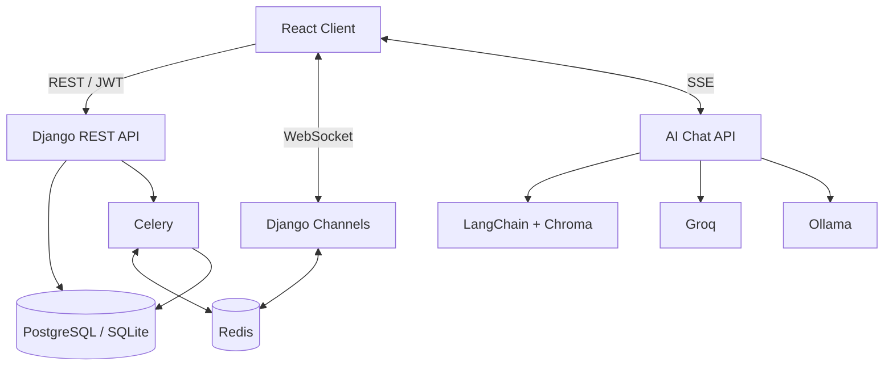

# 学脉（UniPulse Asia）

面向高校学生的校园社交与学术资源平台。项目将校园动态、专业论坛、学生社区、交换与实习机会、即时通信和 AI 学业问答整合在一个 Web 应用中。

这个仓库包含完整的 React 前端和 Django 后端。项目重点不只是页面实现，也包括 JWT 会话管理、领域化 API、实时消息、异步通知以及 RAG 流式问答等前后端协作链路。

## 核心功能

| 模块 | 功能 |
| --- | --- |
| 校园动态 | 发布内容、Feed、标签、评论、点赞、收藏、可见范围 |
| 论坛与社区 | 学院论坛、话题发布、热门标签、社区创建、加入与退出 |
| 学生关系 | 关注、粉丝、好友申请、用户搜索 |
| 即时通信 | 私信、群聊、未读统计、已读状态、在线状态、断线重连 |
| 通知中心 | 点赞、评论、关注及系统通知，支持实时推送 |
| 机会中心 | 交换项目、实习岗位、创业项目、搜索与筛选 |
| 校园资料 | 大学、学院及校园资源信息 |
| AI 助手 | SSE 流式回答、Groq/Ollama、Chroma 向量检索、RAG 回退 |

帖子、论坛话题、社区和实习发布入口均已连接后端 API。论坛概览与热门标签来自数据库聚合；交换项目和实习使用统一收藏模型；消息发送在 WebSocket 不可用时保留 REST 回退路径。

## 技术栈

### Frontend

- React 18、TypeScript、Vite 5
- React Router、Zustand、Axios
- Tailwind CSS、Lucide React
- i18next、React Markdown
- Fetch API + Server-Sent Events

### Backend

- Python、Django 5、Django REST Framework
- Simple JWT、django-filter、drf-spectacular
- Django Channels、Redis
- Celery、Celery Beat
- PostgreSQL；开发环境可回退到 SQLite
- Groq、Ollama、LangChain、Chroma
- 本地媒体存储；可选 Supabase Storage

## 系统设计



后端按业务域拆分为独立 Django app：

```text
authentication   注册、登录、当前用户
users            用户与扩展资料
campus           大学、学院、校园资源
posts            帖子、标签、点赞、Feed
comments         评论与回复
forums           学院论坛与话题
communities      社区与成员关系
social           关注、好友、私信、群聊
notifications    站内通知
bookmarks        跨内容类型收藏
opportunities    交换、实习、创业项目
uploads          媒体上传
ai               流式问答与 RAG
```

通用权限、分页、节流和异常响应位于 `backend/core`，业务模块分别维护模型、序列化器、视图、路由和迁移。

## 关键实现

### JWT 会话与请求层

前端通过共享 Axios Client 管理认证请求。请求拦截器自动附加 Access Token；遇到 `401` 时，多个失败请求共用同一次 Token 刷新，避免并发触发重复请求。刷新失败后统一清理本地会话并返回登录页。

分页响应保留 `data`、`paging` 和 `error` 结构，普通业务响应则由请求层解包，页面与 Store 不需要重复处理 Axios Response。

### 实时消息与在线状态

客户端使用 Access Token 建立 WebSocket 连接。自定义 Channels 中间件负责解析 JWT，Consumer 根据当前用户及群组成员关系加入对应 Channel Group。

消息系统支持：

- 私信与群组消息实时分发
- 群组成员权限检查
- 在线状态和最后在线时间同步
- 未读数量与批量已读
- 客户端自动重连
- WebSocket 发送失败时回退到 REST API

### 异步通知

点赞、评论和关注通过 Django Signals 捕获。事务提交后，通知任务交给 Celery：Worker 持久化通知，并通过 Channels 推送给在线用户；Celery Beat 定期清理超过保留期限的已读通知。

Broker 暂时不可用时，通知创建会回退到同步执行，避免核心业务操作因为队列服务中断而丢失通知。

### AI 与 RAG

AI 助手通过 SSE 将模型输出逐段返回前端。请求流程如下：

1. 接收用户问题并判断是否启用知识库检索。
2. 使用向量模型生成查询向量。
3. 从 Chroma 中检索相关文档片段。
4. 将检索内容与系统提示词组成模型上下文。
5. 优先调用 Groq，无法使用时回退到本地 Ollama。
6. 通过 SSE 返回文本片段、检索状态和完成事件。

知识库或向量检索不可用时，接口会记录异常并继续普通问答，不让 RAG 依赖阻断基础聊天功能。

## 项目结构

```text
.
├── frontend/
│   ├── public/                  # 静态资源
│   ├── src/
│   │   ├── components/          # 业务组件与基础 UI
│   │   ├── hooks/               # SSE 等复用逻辑
│   │   ├── i18n/                # 国际化资源
│   │   ├── lib/                 # API Client、Token、WebSocket
│   │   ├── pages/               # 页面组件
│   │   ├── routes/              # 路由与应用布局
│   │   ├── services/api/        # API 服务层
│   │   ├── store/               # Zustand Store
│   │   └── types/               # TypeScript 类型
│   ├── package.json
│   └── pnpm-lock.yaml
├── backend/
│   ├── apps/                    # Django 业务模块
│   ├── config/                  # Settings、URL、ASGI、WSGI、Celery
│   ├── core/                    # 公共权限、分页、节流、异常处理
│   ├── manage.py
│   ├── requirements.txt
│   └── requirements-ai.txt
└── README.md
```

## 本地运行

### 1. 环境准备

建议使用以下环境：

- Node.js 18+
- pnpm
- Python 3.11+
- PostgreSQL
- Redis

仅浏览普通 REST 功能时可以使用 SQLite。实时消息、在线状态和异步通知需要 Redis；AI 功能还需要 Groq API Key 或本地 Ollama，RAG 需要重新构建 Chroma 索引。

### 2. 启动后端

```bash
cd backend

python -m venv .venv
source .venv/bin/activate

pip install -r requirements.txt -r requirements-ai.txt
cp .env.example .env

python manage.py migrate
python manage.py runserver
```

Windows PowerShell 激活虚拟环境：

```powershell
.venv\Scripts\Activate.ps1
```

后端默认地址：

- REST API：`http://127.0.0.1:8000/api/`
- Swagger UI：`http://127.0.0.1:8000/api/docs/`
- OpenAPI Schema：`http://127.0.0.1:8000/api/schema/`

### 3. 启动实时与异步服务

确保 Redis 已运行，然后分别启动 Worker 和 Beat：

```bash
cd backend
source .venv/bin/activate

celery -A config worker -l info
celery -A config beat -l info
```

### 4. 启动前端

```bash
cd frontend

pnpm install
cp .env.example .env.local
pnpm dev
```

前端默认运行在 `http://localhost:3000`。

## 环境变量

### Backend

| 变量 | 必需 | 用途 |
| --- | :---: | --- |
| `SECRET_KEY` | 是 | Django 签名密钥 |
| `DEBUG` | 否 | 开发环境调试开关 |
| `ALLOWED_HOSTS` | 否 | 允许访问的 Host，逗号分隔 |
| `DATABASE_URL` | 否 | 数据库连接；未配置时使用本地 SQLite |
| `REDIS_URL` | 实时功能必需 | Channels、Celery 默认连接 |
| `CELERY_BROKER_URL` | 否 | 单独指定 Celery Broker |
| `CELERY_RESULT_BACKEND` | 否 | 单独指定 Celery Result Backend |
| `GROQ_API_KEY` | Groq 模式必需 | Groq 推理服务凭据 |
| `SUPABASE_URL` | 否 | Supabase 项目地址 |
| `SUPABASE_SERVICE_ROLE_KEY` | 否 | 服务端存储凭据，不应暴露给前端 |
| `SUPABASE_BUCKET` | 否 | 上传文件所在 Bucket，默认 `uploads` |

### Frontend

| 变量 | 默认值 | 用途 |
| --- | --- | --- |
| `VITE_API_BASE_URL` | `http://127.0.0.1:8000/api` | Django API 根地址，不附加末尾斜杠 |

示例配置分别位于 `backend/.env.example` 和 `frontend/.env.example`。真实环境文件已通过 `.gitignore` 排除。

## 接口入口

| 业务域 | Endpoint |
| --- | --- |
| 认证 | `/api/auth/register/`、`/api/auth/login/`、`/api/auth/me/` |
| 用户与校园 | `/api/users/`、`/api/profiles/`、`/api/universities/`、`/api/schools/` |
| 内容 | `/api/posts/`、`/api/feed/`、`/api/comments/`、`/api/tags/` |
| 论坛与社区 | `/api/forums/`、`/api/topics/`、`/api/communities/` |
| 社交与聊天 | `/api/follow/`、`/api/follows/`、`/api/chat/messages/`、`/api/chat/groups/` |
| 通知与收藏 | `/api/notifications/`、`/api/bookmarks/` |
| 机会 | `/api/exchange_programs/`、`/api/internships/`、`/api/startups/` |
| AI | `/api/ai/chat/stream/`、`/api/ai/chat/sync/`、`/api/ai/health/` |

WebSocket 入口：

```text
/ws/chat/?token=<access-token>
```

完整请求参数和响应结构以 Swagger UI 生成的 OpenAPI 文档为准。

## 代码质量检查

```bash
# Frontend
cd frontend
pnpm lint
pnpm build

# Backend
cd backend
python manage.py check
python manage.py test
```

## License

本项目暂未声明开源许可证。未经许可，不得复制、修改或分发本仓库代码。
